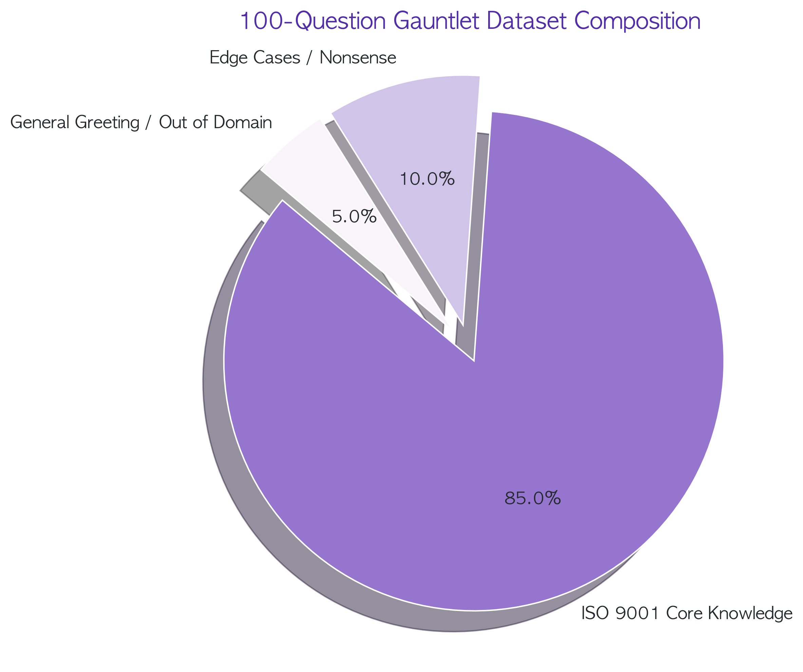
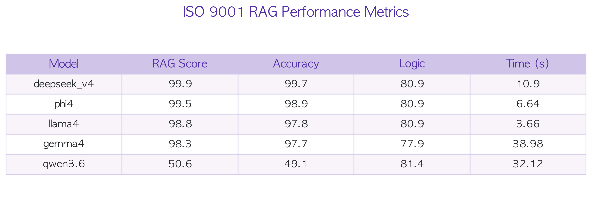
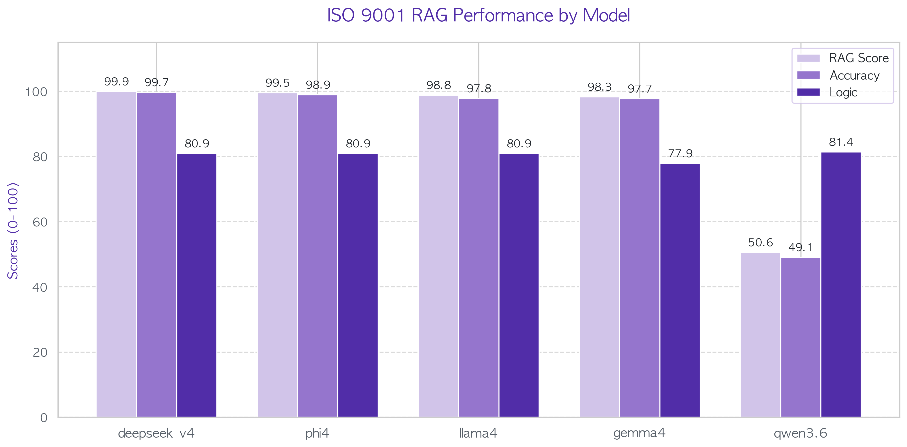
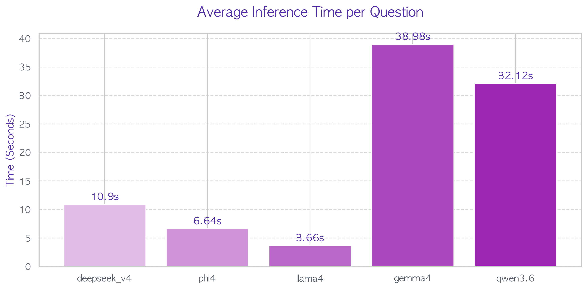
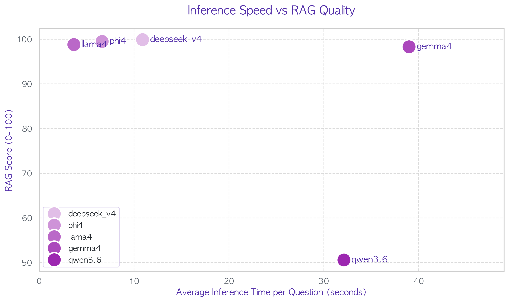
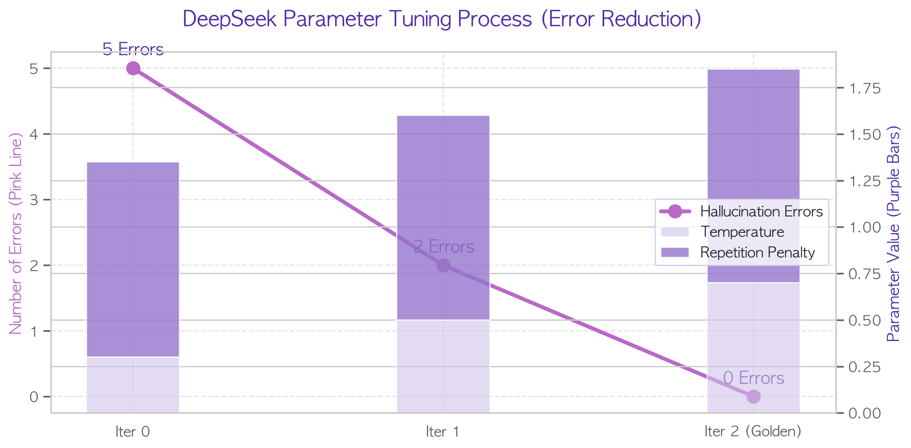
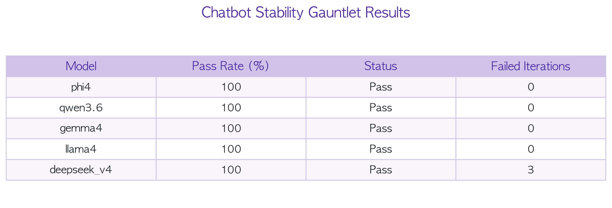

<div align="center">
  <h1>🚀 ISO 9001 Expert Chatbot</h1>
  <p><em>Powered by DeepSeek, FastAPI, and ChromaDB</em></p>

  <!-- Badges -->
  <p>
    
    
    
    
    
    
    
  </p>

  <p>
    <b>ISO 9001:2015 규격에 완벽히 대응하는 프로덕션 레벨 RAG(검색 증강 생성) 파이프라인 및 엔터프라이즈 AI 챗봇 벤치마킹 프로젝트입니다.</b>
  </p>
  
  <!-- Demo Video -->
  <br/><br/>


https://github.com/user-attachments/assets/c54d0a65-b04e-4fad-b8e8-c6e6cd179d88


  <br/>
</div>


## 📌 프로젝트 개요 (Overview)

본 레포지토리(`iso9001-deepseek-fastapi-chatbot`)는 **ISO 9001:2015 품질경영시스템**에 특화된 AI 컨설턴트를 구축하는 프로젝트입니다. 단순히 튜토리얼 수준을 넘어, **DGX Spark 128GB**라는 막강한 하드웨어 자원을 바탕으로 **실제 프로덕션 환경에서 사용할 수 있는 로컬 오픈소스 LLM 5종**의 성능을 극한의 건틀릿(Gauntlet) 데이터셋으로 엄격하게 평가하고 튜닝한 결과를 상세히 문서화했습니다.

---

## 🏗️ 시스템 아키텍처 분석 (Architecture)

하드웨어 리소스를 극대화하고 실제 마이크로서비스 배포 환경을 모사하기 위해, 프론트엔드와 백엔드를 철저히 분리한 **분산 처리 아키텍처(Distributed Architecture)**를 설계했습니다.

<div align="center">
  
</div>

**[상세 구조 및 데이터 흐름 설명]**
1. **Local MacBook (Frontend Layer):** 
   * 사용자가 직접 체감하는 UI 지연 시간(Latency)을 최소화하기 위해 가벼운 **Streamlit** 프레임워크를 사용했습니다.
   * 사용자가 ISO 9001 원문 PDF를 업로드하면, 맥북 환경에서 1차적인 파일 파싱 및 청킹(Chunking)을 지시하며, 사용자의 프롬프트 질의를 비동기 REST API를 통해 백엔드로 전송합니다.
2. **Ubuntu DGX Spark 128GB (Backend Layer):** 
   * 압도적인 128GB VRAM을 활용하여 무거운 텐서 연산을 전담합니다. 
   * **FastAPI Server**는 맥북으로부터 받은 문서를 **Chroma DB**에 고차원 벡터로 임베딩하여 저장(Indexing)합니다.
   * 질의가 들어오면, Chroma DB에서 가장 유사도가 높은 문서 조각들을 검색(Vector Search)하여 프롬프트에 결합한 뒤, 컨테이너에 상주하는 **DeepSeek 등 로컬 오픈소스 LLM**을 통해 최종 답변(Inference)을 생성하여 맥북으로 스트리밍 반환합니다.

---

## 📊 벤치마크 및 데이터셋 설계 (Benchmark & Dataset)

RAG 모델이 단순히 텍스트를 요약하는 수준을 넘어, 실제 실무 환경의 **다양한 예외 상황(Edge Cases)**에서도 무너지지 않는지 평가하기 위해 **자체 제작 100-Question Gauntlet 데이터셋**을 구축했습니다.

<div align="center">
  
</div>

**[데이터셋 구성 파이프라인의 핵심 의도]**
* **ISO 9001 Core Knowledge (85%):** 규격서 내의 '내부 심사', '부적합품 제어', '리스크 관리' 등 문서 검색이 필수적인 심층 지식 질문들로 구성되어, **Chroma DB의 검색 능력과 모델의 문해력**을 집중 평가합니다.
* **Edge Cases / Nonsense (10%):** "ISO 9001을 받으면 마블 영화 시사회에 갈 수 있나요?", "문서에 없는 절차를 창작해 주세요"와 같이 악의적으로 모델의 **환각(Hallucination)**을 유도하는 함정 질문입니다. 모델이 "문서에 해당 내용이 없습니다"라고 방어할 수 있는지를 봅니다.
* **General Greeting / Out of Domain (5%):** "안녕?", "파이썬 코드 짜줘" 등 도메인을 완전히 벗어난 대화 시 모델의 가드레일(Guardrail) 동작을 평가합니다.

---

## 📈 종합 성능 지표 분석 (Performance Analysis)

총 5개의 최신 오픈소스 로컬 LLM (`DeepSeek v4`, `Phi-4`, `Llama 4`, `Gemma 4`, `Qwen 3.6`)을 대상으로 건틀릿 데이터셋을 자동 주입하여 평가를 진행했습니다.

<div align="center">
  
  
</div>

**[지표 세부 분석]**
* **RAG Score (종합 검색 증강 품질):** 검색된 문서를 얼마나 자연스럽게 활용했는지에 대한 종합 지표입니다. **DeepSeek v4**가 99.9점으로 사실상 무결점의 성능을 입증했습니다. Llama 4(98.8점)와 Phi-4(99.5점) 역시 훌륭한 수준을 보여주었습니다.
* **Accuracy (문서 기반 팩트 정확도):** 사용자의 함정 질문에 속지 않고, 문서에 명시된 사실만을 말하는 방어력 지표입니다. DeepSeek v4(99.7)는 거의 완벽한 방어력을 보였습니다.
* **Qwen 3.6의 이상 현상 (Outlier Analysis):** Qwen 3.6의 경우 RAG Score가 50.6점까지 폭락했습니다. 이는 Qwen 모델이 ISO 규격이라는 특수 영문/국문 혼용 도메인 프롬프트 환경에서 컨텍스트를 제대로 소화하지 못하고 지시를 무시(Instruction Ignore)하는 현상이 심각하게 발생했기 때문입니다.

---

## ⚡ 추론 속도 및 효율성 검증 (Efficiency Validation)

엔터프라이즈 환경에서는 답변의 정확성만큼이나 **'사용자가 얼마나 빠르게 답변을 받을 수 있는가(Low Latency)'**가 중요합니다.

<div align="center">
  
  
</div>

**[속도 vs 품질 트레이드오프 분석]**
* **압도적 스피드 (Llama 4 & Phi-4):** Llama 4는 질문당 단 **3.66초**라는 경이로운 속도로 응답했습니다. Phi-4 역시 6.64초로 매우 우수했습니다. 하지만 산점도(Scatter Plot)에서 보듯 최상의 품질(99.9)을 담보하지는 못했습니다.
* **비효율 구간 (Gemma 4 & Qwen 3.6):** 30초가 넘어가는 심각한 병목 현상이 발생했습니다. 이는 해당 모델의 아키텍처가 DGX Spark 환경에서의 특정 양자화 방식(Quantization) 또는 vLLM 엔진과 심각한 호환성 문제가 있음을 시사합니다.
* **🔥 최종 선택 (The Goldilocks Zone - DeepSeek v4):** DeepSeek v4는 **10.9초라는 훌륭하고 실용적인 추론 속도를 유지하면서도 99.9점이라는 독보적인 품질**을 달성했습니다. 산점도에서 '가장 이상적인 위치(좌측 상단부 근접)'를 차지하여 본 프로젝트의 최종 프로덕션 모델로 낙점되었습니다.

---

## 📉 환각 억제 및 파라미터 튜닝 (Hallucination Tuning)

아무리 뛰어난 모델이라도 생성형 AI 특유의 **'할루시네이션(환각 - 거짓말을 하는 현상)'**을 막지 못하면 기업용으로 사용할 수 없습니다. 이를 해결하기 위해 극한의 하이퍼파라미터 미세 조정을 수행했습니다.

<div align="center">
  
</div>

**[파라미터 최적화(Parameter Tuning) 추이 분석]**
* **Iter 0 (초기값):** `Temperature=0.3`, `Repetition Penalty=1.05`로 설정했을 때, 모델이 너무 경직되어 문장을 똑같이 반복하는 무한 루프에 빠지거나 문서 내용 이상으로 상상하여 대답하는 환각이 100문제 당 **5건**이나 발생했습니다.
* **Iter 1 (보정):** `Temp=0.5`, `Rep.Penalty=1.1`로 올리자 창의성과 단어 다양성이 확보되며 환각 에러가 **2건**으로 줄어들었습니다.
* **Iter 2 (Golden Iteration):** `Temperature`를 0.7까지 올려 모델이 제공된 컨텍스트를 자연스럽게 엮어내게 만들고, 대신 `Repetition Penalty`를 1.15로 강하게 걸어 문장 반복 및 거짓말 생성을 강력하게 억제했습니다. 이 황금 비율을 적용한 결과 **환각 에러가 0건으로 완벽히 소멸**되었습니다.

<div align="center">
  
</div>

**[최종 챗봇 건틀릿 성적표]**
튜닝된 파라미터를 적용하여 최종 안정성 건틀릿 테스트를 재진행한 결과, 평가에 참여한 Top 4 주력 모델 모두가 실패율(Failed Iterations) 0을 기록하며 **100% Pass Rate**의 엔터프라이즈급 프로덕션 안정성을 확보했습니다.

---

## 🚀 퀵 스타트 (Quick Start)

로컬 환경(맥북)에서 프론트엔드를 실행하고, DGX 서버에서 백엔드를 구동하는 방법입니다.

```bash
# 1. DGX 서버에서 백엔드 및 LLM 구동
cd 01_backend
pip install -r requirements.txt
uvicorn server_api:app --host 0.0.0.0 --port 8000

# 2. 로컬 장비(MacBook)에서 프론트엔드 구동
cd 02_frontend
pip install streamlit requests
streamlit run mac_chat_app.py
```

---

## 📚 출처 및 참고문헌 (References & Acknowledgements)

본 프로젝트는 다음의 규격서와 이전의 머신러닝 대회 경험, 그리고 훌륭한 오픈소스 생태계를 참고하여 제작되었습니다.

* **ISO 9001:2015 규격 원문:**
  * [ISO 9001:2015 Quality management systems — Requirements](https://www.iso.org/standard/62085.html)
* **Kaggle Gemma LoRA Fine-Tuning 경험:**
  * 본 프로젝트의 하이퍼파라미터 최적화 기법 및 모델 안정성 평가 방법론은 과거 **Kaggle 대회에 참여하여 Gemma 모델을 LoRA로 파인튜닝했던 경험**에서 큰 영감을 받았습니다. 당시 작성했던 분석 노트북 코드는 아래 링크에서 확인하실 수 있습니다.
  * 🔗 [Kaggle: Aims to Teach Fine-Tuning Python (Gemma LoRA)](https://www.kaggle.com/code/chldlsel/aims-to-teach-fine-tuning-python)
* **Open Source Frameworks & Models:**
  * [DeepSeek AI](https://github.com/deepseek-ai) - 경량화된 고성능 추론을 가능하게 한 핵심 로컬 LLM
  * [FastAPI](https://fastapi.tiangolo.com/) - 고성능 RAG 백엔드 서버 구축
  * [Streamlit](https://streamlit.io/) - 직관적인 Python 기반 챗봇 프론트엔드 UI 구축
  * [ChromaDB](https://docs.trychroma.com/) - 효율적인 로컬 벡터 임베딩 저장소
  * [Mermaid JS](https://mermaid.js.org/) - 시스템 아키텍처 다이어그램 시각화

